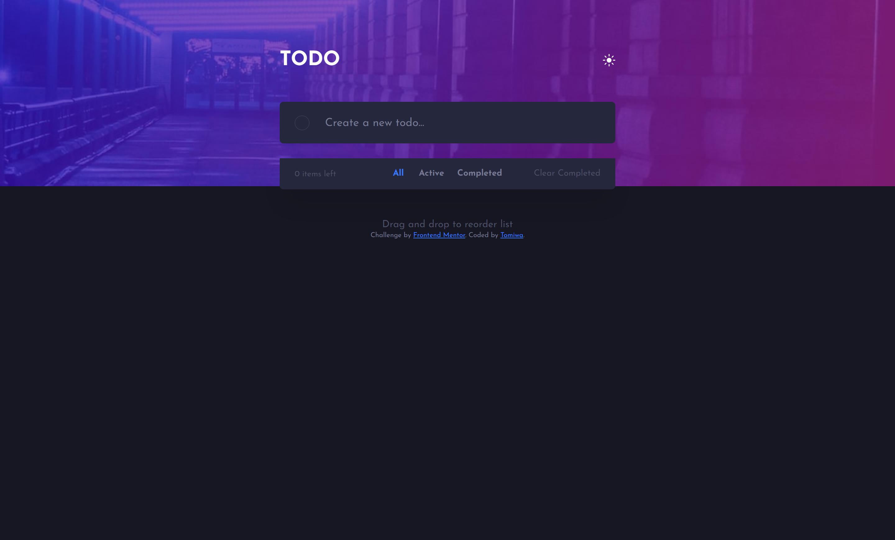

# Frontend Mentor - Todo app solution

This is a solution to the [Todo app challenge on Frontend Mentor](https://www.frontendmentor.io/challenges/todo-app-Su1_KokOW). Frontend Mentor challenges help you improve your coding skills by building realistic projects. 

## Table of contents

- [Overview](#overview)
  - [The challenge](#the-challenge)
  - [Screenshot](#screenshot)
  - [Links](#links)
- [My process](#my-process)
  - [Built with](#built-with)
  - [What I learned](#what-i-learned)
  - [Continued development](#continued-development)
  - [Useful resources](#useful-resources)
- [Author](#author)
- [Acknowledgments](#acknowledgments)


## Overview

### The challenge

Users should be able to:

- View the optimal layout for the app depending on their device's screen size
- See hover states for all interactive elements on the page
- Add new todos to the list
- Mark todos as complete
- Delete todos from the list
- Filter by all/active/complete todos
- Clear all completed todos
- Toggle light and dark mode
- **Bonus**: Drag and drop to reorder items on the list

### Screenshot




### Links

- Solution URL: [Add solution URL here](https://your-solution-url.com)
- Live Site URL: [Add live site URL here](https://your-live-site-url.com)

## My process

### Built with

- Semantic HTML5 markup
- CSS custom properties
- Flexbox
- Desktop-first workflow

### What I learned

I was able to flex my DOM Manipulation ability and also my array manipulation ability with Array methods.


```js
todoListArray.filter(item => item.tdStatus === true).forEach(item =>{
  document.getElementById(item.id).closest("li").style.display="none"
});
```

### Continued development

I would still love to work more on the drag event listener. I used the help of an external JS libary to achive the function.


### Useful resources

- [Sortablejs](https://cdnjs.com/libraries/Sortable) - This helped me for the drag logic.I will try and fix something simlar up in future projects
- [MDN Docs](https://developer.mozilla.org) - I cannot state the importance of this
- [Aria24](https://www.w3.org/WAI/WCAG21/Techniques/aria/ARIA24.html) - Helps tag div elements with semantic embodiment with the use of "role"

## Author

- Frontend Mentor - [@jidoggs](https://www.frontendmentor.io/profile/jidoggs)
- Twitter - [@jidde](https://www.twitter.com/jidde_)

## Acknowledgments

I would like to thank James from Stuttern. He helped me to write shorter code that makes a lot of sense